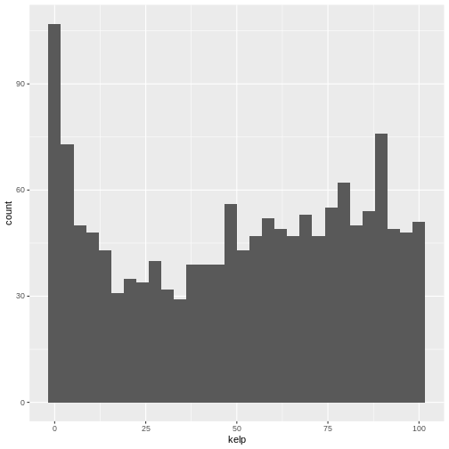
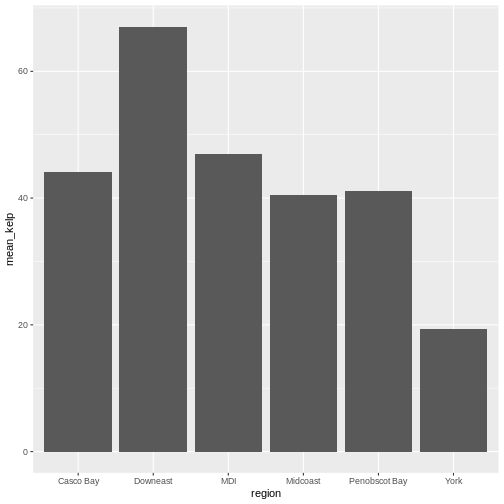
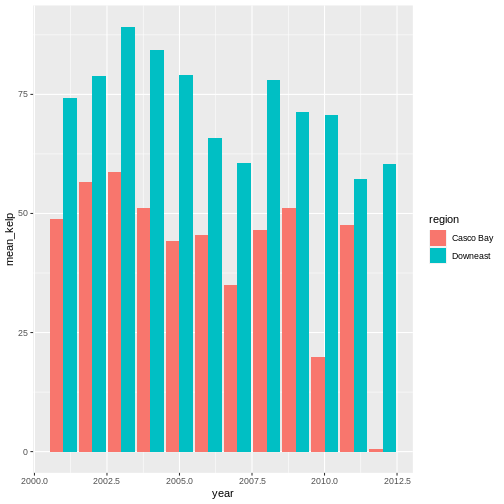

::::::::::::::::::::::::::::::::::::::: objectives

- To be able to use ggplot2 to generate histograms and bar plots.
- To apply geometry and aesthetic layers to a ggplot plot.
- To manipulate the aesthetics of a plot using different colors and position parameters.

::::::::::::::::::::::::::::::::::::::::::::::::::

:::::::::::::::::::::::::::::::::::::::: questions

- What are the basics of creating graphics in R?

::::::::::::::::::::::::::::::::::::::::::::::::::

Let's start by loading data to plot. For convenience, let's make site a character.


```r
library(dplyr)

dmr <- read.csv("data/dmr_kelp_urchin.csv") |>
  mutate(site = as.character(site))
```

Plotting our data is one of the best ways to quickly explore it and the various
relationships between variables. There are three main plotting systems in R, the
[base plotting system](https://www.statmethods.net/graphs/), the
[lattice](https://www.statmethods.net/advgraphs/trellis.html) package, and the
[ggplot2](https://www.statmethods.net/advgraphs/ggplot2.html) package. Today and
tomorrow we'll be learning about the ggplot2 package, because it is the most
effective for creating publication quality graphics. In this episode, we will
introduce the key features of a ggplot and make a few example plots. We will
expand on these concepts and see how they apply to geospatial data types when we
start working with geospatial data in the [R for Raster and Vector
Data](https://cobalt-casco.github.io/r-raster-vector-geospatial/) lesson.

:::::::::::::::::::::::::::::::::::::::  instructor

- This episode introduces `geom_col` and `geom_histogram`. These geoms are used
  in the rest of the workshop, along with geoms specifically for geospatial 
  data.
- Emphasize that we will go much deeper into visualization and creating
  publication-quality graphics later in the workshop.

:::::::::::::::::::::::::::::::::::::::

ggplot2 is built on the grammar of graphics, the idea that any plot can be
expressed from the same set of components: a **data** set, a **coordinate
system**, and a set of **geoms** (the visual representation of data points). The
key to understanding ggplot2 is thinking about a figure in layers. This idea may
be familiar to you if you have used image editing programs like Photoshop,
Illustrator, or Inkscape. In this episode we will focus on two geoms

- histograms and bar plot. In the [R for Raster and Vector Data](https://datacarpentry.org/r-raster-vector-geospatial/) lesson we will work with a number of other geometries
  and learn how to customize our plots.

Let's start off with an example plotting the distribution of kelp % cover in our dataset. 
The first thing we do is call the `ggplot` function. This function lets R
know that we're creating a new plot, and any of the arguments we give the
`ggplot()` function are the global options for the plot: they apply to all
layers on the plot.

We will pass in two arguments to `ggplot`. First, we tell `ggplot` what data we
want to show on our figure. For the second argument we pass in the `aes()` function, 
which tells `ggplot` how variables in the data map to aesthetic properties of the 
figure. Here we will tell `ggplot` we want to plot the "kelp" column of the dmr 
data frame on the x-axis. We don't need to specify a y-axis for histograms.


```r
library(ggplot2)

ggplot(data = dmr, 
       mapping = aes(x = kelp)) +   
  geom_histogram()
```

<div class="figure" style="text-align: center">

<p class="caption">Histogram of histogram of kelp percent cover sampled by the DMR</p>
</div>

By itself, the call to `ggplot` isn't enough to draw a figure:


```r
ggplot(data = dmr, aes(x = kelp))
```


We need to tell `ggplot` how we want to visually represent the data, which we
do by adding a geom layer. In our example, we used `geom_histogram()`, which
tells `ggplot` we want to visually represent the
distribution of one variable (in our case "kelp"):


```r
ggplot(data = dmr, aes(x = kelp)) +   
  geom_histogram()
```

```{.output}
`stat_bin()` using `bins = 30`. Pick better value with `binwidth`.
```



:::::::::::::::::::::::::::::::::::::::  challenge

## Challenge 1

Modify the example so that the figure shows the
distribution of urchin counts, rather than kelp 
percent cover.

:::::::::::::::  solution

## Solution to challenge 1


```r
ggplot(data = dmr, 
       mapping = aes(x = urchin)) +   
 geom_histogram()
```

```{.output}
`stat_bin()` using `bins = 30`. Pick better value with `binwidth`.
```


:::::::::::::::::::::::::

::::::::::::::::::::::::::::::::::::::::::::::::::

The histogram is a useful tool for visualizing the
distribution of a single continuous variable. What if
we want to compare the kelp cover of the regions in
our dataset? We could use a bar (or column) plot.

First, let's create a dataset with the mean % kelp for each region.


```r
region_mean_kelp <- dmr |>
  group_by(region) |>
  summarize(mean_kelp = mean(kelp))
```

This time, we will use the `geom_col()` function as our geometry.
We will plot regions on the x-axis (listed in alphabetic order
by default) and mean kelp on the y-axis.


```r
ggplot(data = region_mean_kelp, 
       mapping = aes(x = region, y = mean_kelp)) + 
  geom_col()
```

<div class="figure" style="text-align: center">

<p class="caption">Bar plot of the mean percent kelp cover for each region</p>
</div>

This looks okay, although perhaps you might want to display more than just the
mean values. You could try another geometry: box plots, with `geom_boxplot`. Here we need the 
full un-summarized dataset. You might also want to specify axis labels by using the
function `labs`.


```r
ggplot(data = dmr, 
       mapping = aes(x = region, y = kelp)) + 
  geom_boxplot() +
  labs(x = "Region", y = "Percent Kelp Cover")
```

<div class="figure" style="text-align: center">

<p class="caption">Box plot of kelp cover for each region</p>
</div>

There are more sophisticated ways of modifying axis labels. We will be learning some of those methods later in this workshop.

:::::::::::::::::::::::::::::::::::::::  challenge

## Challenge 2: A regional subset of the data over time

Let's combine `dplyr` with `ggplot2` to create a visualization of how kelp has
changed by region over time. This is a complex workflow - but a pretty typical
one. We're going to break it down piece by piece here so you can see how we 
create a whole piece of visualization starting with a large complex object.

Our goal is to create a time series plot for two regions of mean kelp.

**dplyr portion** - For each part of the exercise, just keep piping to create
a full workflow that will result in `casco_downeast_kelp`. Check your answer 
after each step to make sure it's correct.

1. What are our two regions and years that we want? Let's start by creating a
data set called `casco_downeast_kelp`. Filter down to just the `Casco Bay` and 
`Downeast` regions. This is a great place to use the `%in% operator for the
filter. After filtering regions, filter `year` to just the years 2001 - 2012.
You can use some `<` `>` for this or use `%in%.

2. Next, group by both region and year (you can use a `,` to separate grouping
variables in `group_by()`).

3. Summarize to get the mean value of kelp for each year/region combination.

**ggplot2 portion** - use `casco_downeast_kelp` to plot the following.

4. Make a `ggplot()` just like we did before with a `geom_col()`. But, now, 
set your x value to be year. Also, make `fill = region`. What does this show you?
What happens if you add an additional argument to `geom_col()` so that you have
`geom_col(position = position_dodge())`.

5. One of the beautiful things about `ggplot2` is how we can make a few small 
changes and get a totally different visualization that teaches us something new.
Copy and paste the plot you made in 4. Remove the `geom_col()`. Now, add 
`geom_point()` and `geom_line()` in succession. Also, remove the fill aesthestic
and change add in `color = region` instead.

:::::::::::::::  solution

## Solution to challenge 2

**dplyr portion** 

1. 

```r
casco_downeast_kelp <- dmr |>
  filter(region %in% c("Casco Bay", "Downeast")) |>
  filter(year %in% 2001:2012)

head(casco_downeast_kelp)
```

```{.output}
  year    region exposure.code coastal.code latitude longitude depth crust
1 2001 Casco Bay             2            2 43.72766 -70.10721     5   6.1
2 2001 Casco Bay             2            2 43.76509 -69.96087     5  31.5
3 2001 Casco Bay             3            3 43.75199 -69.93420     5  31.5
4 2001 Casco Bay             2            2 43.78369 -69.89041     5  40.5
5 2001 Casco Bay             2            2 43.79288 -69.88675     5  53.0
6 2001 Casco Bay             1            2 43.79686 -69.88665     5  26.5
  understory  kelp urchin month day survey site
1       38.5  92.5      0     6  15    dmr   66
2       74.0  59.0      0     6  15    dmr   71
3       96.5   7.7      0     6  15    dmr   70
4       60.0  52.5      0     6   8    dmr   23
5       59.5  29.2      0     6   8    dmr   22
6       15.0 100.0      0     6   8    dmr   21
```


2. 

```r
casco_downeast_kelp <- dmr |>
  filter(region %in% c("Casco Bay", "Downeast")) |>
  filter(year %in% 2001:2012) |>
  group_by(year, region)

head(casco_downeast_kelp)
```

```{.output}
# A tibble: 6 × 15
# Groups:   year, region [1]
   year region    exposure.code coastal.code latitude longitude depth crust
  <int> <chr>             <int>        <int>    <dbl>     <dbl> <int> <dbl>
1  2001 Casco Bay             2            2     43.7     -70.1     5   6.1
2  2001 Casco Bay             2            2     43.8     -70.0     5  31.5
3  2001 Casco Bay             3            3     43.8     -69.9     5  31.5
4  2001 Casco Bay             2            2     43.8     -69.9     5  40.5
5  2001 Casco Bay             2            2     43.8     -69.9     5  53  
6  2001 Casco Bay             1            2     43.8     -69.9     5  26.5
# ℹ 7 more variables: understory <dbl>, kelp <dbl>, urchin <dbl>, month <int>,
#   day <int>, survey <chr>, site <chr>
```

3. 


```r
casco_downeast_kelp <- dmr |>
  filter(region %in% c("Casco Bay", "Downeast")) |>
  filter(year %in% 2001:2012) |>
  group_by(year, region) |>
  summarize(mean_kelp = mean(kelp))
```

```{.output}
`summarise()` has grouped output by 'year'. You can override using the
`.groups` argument.
```

```r
head(casco_downeast_kelp)
```

```{.output}
# A tibble: 6 × 3
# Groups:   year [3]
   year region    mean_kelp
  <int> <chr>         <dbl>
1  2001 Casco Bay      48.8
2  2001 Downeast       74.3
3  2002 Casco Bay      56.7
4  2002 Downeast       78.8
5  2003 Casco Bay      58.7
6  2003 Downeast       89.2
```

**ggplot2 portion**

4. 

```r
ggplot(data = casco_downeast_kelp,
       mapping = aes(x = year, y = mean_kelp, fill = region)) +
  geom_col()
```


```r
ggplot(data = casco_downeast_kelp,
       mapping = aes(x = year, y = mean_kelp, fill = region)) +
  geom_col(position = position_dodge())
```



5. 


```r
ggplot(data = casco_downeast_kelp,
       mapping = aes(x = year, y = mean_kelp, color = region)) +
  geom_point() +
  geom_line()
```


:::::::::::::::::::::::::

::::::::::::::::::::::::::::::::::::::::::::::::::

The examples given here are just the start of
creating complex and beautiful graphics with R.
In [a later lesson](https://datacarpentry.org/r-raster-vector-geospatial/) we will go into much
more depth, including:

- plotting geospatial specific data types
- adjusting the color scheme of our plots
- setting and formatting plot titles, subtitles, and axis labels
- creating multi-panel plots
- creating point (scatter) and line plots
- layering datasets to create multi-layered plots
- creating and customizing a plot legend
- and much more!

The examples we've worked through in this episode should give you the building
blocks for working with the more complex graphic types and customizations we
will be working with in that lesson.

:::::::::::::::::::::::::::::::::::::::: keypoints

- Use `ggplot2` to create plots.
- Think about graphics in layers: aesthetics, geometry, etc.

::::::::::::::::::::::::::::::::::::::::::::::::::


